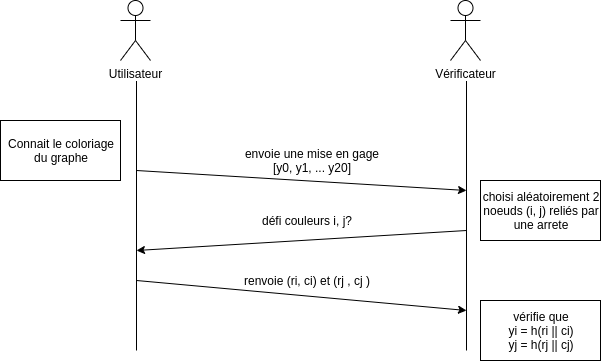

Sylvan LE DEUNFF, ENSSAT, IMR3

---

# Accréditation anonyme et coloriage de graphe

## Preuve à divulgation nulle de connaissance

### Contexte

* Un utilisateur souhaite convaincre un vérificateur qu’il connaît une manière
de colorier entièrement un graphe avec 3 couleurs de telle façon qu’aucun
nœud du graphe n’ait la même couleur que l’un des nœuds voisins.

* Il ne doit révéler aucune autre information à propos de ce coloriage.

### Echanges

### Questions

1. *Pourquoi est ce que si l’utilisateur et le vérificateur sont honnêtes et suivent les directives du protocole, un utilisateur possédant la preuve d’un 3-coloriage pourra toujours convaincre le vérificateur (propriété de completeness) ?*

**A COMPLETER**

2. *Pourquoi est ce qu’un utilisateur qui ne possède pas de preuve d’un 3-coloriage ne pourra pas réussir à convaincre un vérificateur, sauf avec une probabilité négligeable (propriété de soundness) ?*

L'étape d'`engagement` impose que les couleurs des noeuds doivent être fixées avant d'effectuer la `mise en gage`. L'utilisateur qui ne connait pas de coloriage doit donc en tirer un aléatoirement.

Puis lors d'un challenge, le vérificateur demande les couleurs associées à 2 noeuds. La probabilité que ces 2 noeuds de la réponse (choisies aléatoirement par l'utilisateur) soient de couleur identique est d'environ 1/3. La probabilité de succès (ie: les noeuds voisins sont de couleur différente) pour l'utilisateur est donc d'environ 2/3.

En **répétant** ce schéma (permutation + engagement + challenge + réponse) **400 fois**, la probabilité de succès pour l'utilisateur ne connaissant pas de solution est donc de 

    p = (2/3)^400 ~ 3.7 x 10^(-71)

Les chances pour qu'une solution déterminée aléatoirement puisse tromper le vérificateur sont donc infimes.

3. *Expliquer en quoi ce protocole est à divulgation nulle (zero-knowledge en anglais), c’est à dire qu’il n’apporte aucune autre information au vérificateur de la véracité de l’énoncé*

**Engagement**: le verificateur ne reçoit que la `mise en gage`, dans laquelle les informations des couleurs des noeuds sont hashées avec un sel. `Cette donnée seule n'apporte aucune information`.

**Défi**: le vérificateur envoie les indices de 2 noeuds adjacents. (pas d'information concernant l'utilisateur)

**Réponse**: L'utilisateur renvoie les clés (sel, couleur) de 2 noeuds sélectionnés au hasard par le verificateur. Puisque les couleurs ont étés permutés, la véritable **couleur** des noeuds **n'est pas divulguée**.

Aucune information concernant la solution de l'utilisateur n'a donc été transmise.